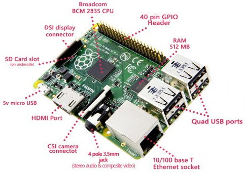

Installation du système
=======================

Préparation et câblage
----------------------

    Connecteurs présents sur le Raspberry Pi [#]_ .

Avant de mettre sous tension la carte, il faut brancher les périphériques essentiels :

- Mettre la carte SD dans son emplacement
- Connecter le câble HDMI (écran)
- Connecter le clavier et la souris aux ports USB
- Connecter le port micro-usb d'alimentation

Le port Ethernet est falcuatif, plus tard nous allons connecter le Pi à internet par Wifi.

Il est maintenant temps de brancher le bloc secteur.

.. [#] http://gurau-audibert.hd.free.fr/josdblog/2014/10/raspberry-pi-model-b-par-ou-commencer/

Installation du système d'exploitation
--------------------------------------
Le système démarre et affiche le programme d'installation après quelques instants.

- Cochez la case pour installer Raspbian, le système d'exploitation pour le Raspberry Pi.
- Cliquez sur Install
- Confirmer; ceci effacera toutes les données de la carte SD

Le programme d'installation copie maintenant les fichiers utiles. En attendant, on peux configurer la langue et le clavier.
- Au fond de l'écran, choisir la langue (français) et le clavier (ch).

Quand tout est terminé, cliquez sur OK; le système redémarre.

Premier démarrage et configuration
----------------------------------

Configuration de base
~~~~~~~~~~~~~~~~~~~~~
Pour accéder à la configuration :

- Menu (Logo Raspberry Pi en haut à gauche)
- Preferences
- Rasperry Pi Configuration

L'onglet Localisation permet les réglages de la langue, du fuseau horaire, du clavier et de la zone wifi.

- Regler la localisation (Set Locale...) sur Francais, Suisse.
- Regler le fuseau horaire (Set Timezone...) sur Europe, Zurich.
- Regler le clavier (Set Keyboard...) sur Francais, Suisse.
- Régler la zone wifi (Set WiFi Country...) sur CH Switzerland.

Cliquez sur ok pour valider les changements et confirmer le redémarrage avec yes.

Connexion au WiFI
~~~~~~~~~~~~~~~~~
Pour se connecter au Wifi, cliquez sur l'icone réseau (En haut à droite).

- Cliquez sur le réseau **WiFi-AP-EspaceC** et entrez le mot de passe qui vous à été donné.
- Le logo "antenne" s'affiche pour indiquer la connexion.

Vous pouvez tester la connexion en lançant le navigateur web à l'adress http://www.fablab-sion.ch.

